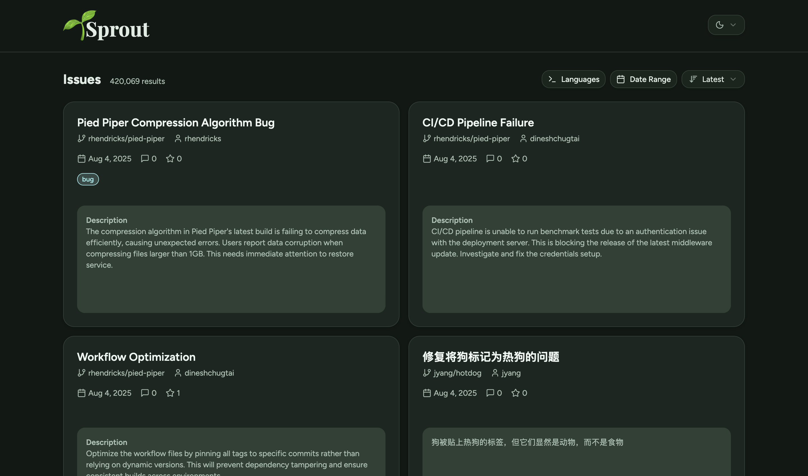

# 🌱 Sprout

A GitHub issue discovery tool that helps you find open source issues to contribute to

<table>
  <tr>
    <td>
      
    </td>
    <td>
      
    </td>
  </tr>
</table>

## Features

- 🔍 Search GitHub issues by programming language
- 📅 Filter by date ranges with presets
- 🎯 Sort by creation date, comments, and more
- ⚡ Real-time filtering with GitHub API

## Getting Started

### Prerequisites

- Node.js 20+ 
- pnpm

### Installation

1. Clone the repository
2. Install dependencies:
   ```bash
   pnpm install
   ```

3. Start the development server:
   ```bash
   pnpm dev
   ```

## Usage

1. Select programming languages you're interested in
2. Optionally set date ranges to filter recent issues
3. Use the sort options to find issues that match your preferences
4. Click on any issue to view it on GitHub

## Development

- Built with React/Vite + TypeScript
- Uses [Octokit](https://www.npmjs.com/package/octokit) for GitHub API integration
- Styled with Tailwind CSS and Radix UI components
- Formatted with Biome